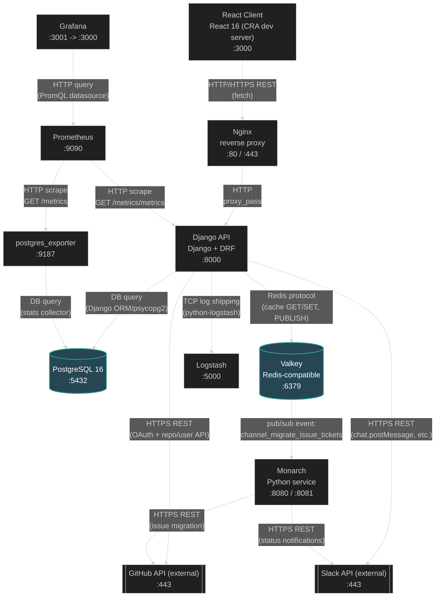

## What each node does

**React Client** (`learn-ops-client`, React 16 / Create React App, `:3000`)
The learner/instructor-facing web app — cohorts, assessments, projects, capstones, team formation, notes, learning records. This is where every user session starts, including kicking off GitHub OAuth login. In local dev it talks straight to the Django API on `:8000` (`REACT_APP_API_URI`); in production it's a static build served by Nginx rather than a running process.

**Nginx** (reverse proxy, `:80` / `:443`)
Production-only edge layer (`learn-ops-api/config/nginx*.conf`). Terminates TLS (Certbot certs for `learningapi.nss.team` and `learning.nss.team`), reverse-proxies API traffic to the Django container, and serves the built React app's static files directly. Not part of the local docker-compose dev stack — that's why it doesn't sit between Client and API there.

**Django API** (`learn-ops-api`, Django + Django REST Framework, `:8000`)
The core backend and the hub of the whole system. Owns essentially all business logic: cohort/student/assessment/project/capstone CRUD, GitHub OAuth login, team formation, and Slack notifications. Almost every other node exists either to support this service (database, cache, logs, metrics) or is called out to by it (GitHub, Slack, Monarch via Valkey).

**PostgreSQL 16** (`:5432`)
The system of record for all LMS data (users, cohorts, assessments, projects, teams, etc.), accessed via the Django ORM/psycopg2. Also stores application log records written by `django_db_logger`, which the API's built-in `/logs/` page (LogViewer) reads back for in-app log inspection.

**Valkey** (Redis-compatible, `:6379`)
Does two unrelated jobs for the API: (1) a plain cache — e.g. the "popular queries" endpoint caches expensive lookups — and (2) a pub/sub message bus. When a student team is formed, the API `PUBLISH`es a `channel_migrate_issue_tickets` event instead of doing the (slow) GitHub work inline; Monarch is the subscriber that picks it up.

**Monarch** (`service-monarch`, standalone Python service, `:8080` / `:8081`)
A decoupled background worker that offloads slow GitHub issue-migration work from the API's request cycle. It subscribes to Valkey for team-creation events, copies issues from a source/template repo into each new team's repo via the GitHub API, and reports progress to Slack. `:8080` exposes its own Prometheus metrics; `:8081` is a small Flask UI for browsing its own logs.

**Logstash** (`:5000`)
Destination for centralized log shipping — Django's root logger has a `TCPLogstashHandler` that streams structured JSON logs here over TCP (`LearningPlatform/settings.py`), for a log-aggregation pipeline. It isn't defined as a container in this repo's compose files, so it's assumed to be provisioned elsewhere in the real deployment.

**Prometheus** (`:9090`)
Metrics collector. Scrapes the Django API's `/metrics/metrics` endpoint (via `django-prometheus`) and `postgres_exporter`'s `/metrics`, storing the resulting time series for querying/alerting. Notably, it is *not* configured to scrape Monarch's `:8080` metrics endpoint even though Monarch exposes one.

**postgres_exporter** (`:9187`)
A sidecar that queries PostgreSQL directly for database health/performance stats (connections, query stats, etc.) and re-exposes them in Prometheus's scrape format, since Postgres doesn't speak that format natively.

**Grafana** (`:3001` host → `:3000` container)
Dashboarding UI layered on top of Prometheus as its datasource, used to visualize API and database health/metrics.

**GitHub API** (external, `:443`)
Used for two distinct purposes: (1) OAuth login — the API exchanges the code the client received from GitHub for an access token and pulls the user's profile/email (`django-allauth`), and (2) real repo operations — creating team repositories and checking org membership from the API, and migrating issues between repos from Monarch.

**Slack API** (external, `:443`)
Used purely for operational notifications: the API creates/archives per-team Slack channels and posts messages (e.g. the `notify` endpoint instructors use to message a cohort channel), while Monarch posts issue-migration status updates (queued/completed/failed) to a Slack channel.