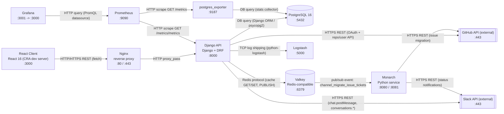

```mermaid
graph LR
    Client["React Client<br/>React 16 (CRA dev server)<br/>:3000"]
    Nginx["Nginx<br/>reverse proxy<br/>:80 / :443"]
    API["Django API<br/>Django + DRF<br/>:8000"]
    DB[("PostgreSQL 16<br/>:5432")]
    Valkey[("Valkey<br/>Redis-compatible<br/>:6379")]
    Monarch["Monarch<br/>Python service<br/>:8080 / :8081"]
    Logstash["Logstash<br/>:5000"]
    Prometheus["Prometheus<br/>:9090"]
    PGExporter["postgres_exporter<br/>:9187"]
    Grafana["Grafana<br/>:3001 -> :3000"]
    GitHub[["GitHub API (external)<br/>:443"]]
    Slack[["Slack API (external)<br/>:443"]]

    Client -->|"HTTP/HTTPS REST (fetch)"| Nginx
    Nginx -->|"HTTP proxy_pass"| API
    API -->|"DB query (Django ORM / psycopg2)"| DB
    API -->|"Redis protocol (cache GET/SET, PUBLISH)"| Valkey
    API -->|"TCP log shipping (python-logstash)"| Logstash
    API -->|"HTTPS REST (OAuth + repo/user API)"| GitHub
    API -->|"HTTPS REST (chat.postMessage, conversations.*)"| Slack
    Valkey -->|"pub/sub event: channel_migrate_issue_tickets"| Monarch
    Monarch -->|"HTTPS REST (issue migration)"| GitHub
    Monarch -->|"HTTPS REST (status notifications)"| Slack
    Prometheus -->|"HTTP scrape GET /metrics/metrics"| API
    Prometheus -->|"HTTP scrape GET /metrics"| PGExporter
    PGExporter -->|"DB query (stats collector)"| DB
    Grafana -->|"HTTP query (PromQL datasource)"| Prometheus
```